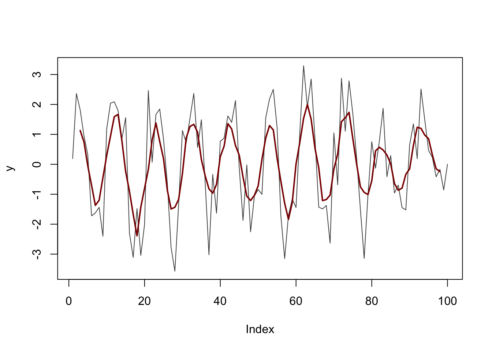
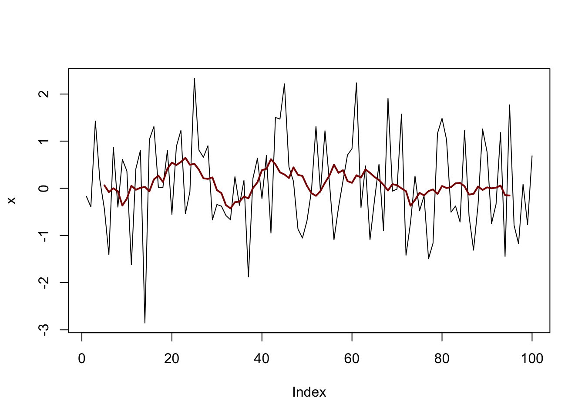

# Introduction

The `R` language and programming environment is now commonly used in dendrochronology. `R` is the world's  preeminent open-source statistical computing software and its power can be harnessed for tree-ring science through the contribution of add-on packages which are freely available on the internet. There are now many `R` packages for working with dendro data from measuring (`measuRing`) to standardization and chronology building (`dplR`, `detrendeR`), to fire history (`burnr`) to disturbance (`TRADER`) to climate-growth analysis (`treeclim`, `pointRes`, `dendroTools`, `BIOdry`) to working with data from dendrometers (`dendrometeR`) and cell anatomy (`tracheideR`, `RAPTOR`). 

Although extremely powerful, `R` has a steep learning curve that has led some to postpone using it in their own work. In these pages we will demonstrate the ways in which analysts can work with tree-ring data in `R` over the entire life cycle of a project in a transparent and reproducible way -- from initial measuring of the wood to statistical tests to producing publication-quality graphics.  These pages are written as a demonstration using on-board data sets but can easily be adapted for users to work with their own data.

## Layout
This document is laid out in chapters covering some of the more common where statistical software can helpful in in dendrochronology. Although focused on using `dplR`, we will make use of other packages throughout. If those are not installed on your system, you can get them from CRAN using `install.packages`. You only have to install a package once. After that it can be loaded with the `library` function as described in the next section.

## Before Starting

### R

Install `R` by visiting [www.r-project.org](https://www.r-project.org/). 
We recommend that you use [RStudio](https://www.rstudio.com/) to interact with, and script in `R`. These documents were all made using R version 4.1.3 (2022-03-10).

### Getting dplR

Install the add-on library `dplR`. You can download and install `dplR `using the `install.packages` function from the `R` prompt:

```r
install.packages("dplR")
```

These documents use version 1.7.3 of `dplR`. You can check the version of your version of `dplR` via:


```r
packageVersion("dplR")
```

If your version is older you can update it (and all your other packages) in `R` via:

```r
update.packages()
```

These documents were all made using the most up-to-date versions of the packages available on the Comprehensive R Archive Network. Updating regularly is good practice!

### A Note on Libraries

A common problem when using libraries is when two libraries use the same function  names. This causes a conflict. For instance, the `filter` which loads as part of `R`'s initial load applies linear filtering to a time series. E.g., We might make a moving average with a width of 10 via:


```r
x <- rnorm(100)
xFilt5 <- filter(x, rep(1/10, 10),side=2)
plot(x,type="l")
lines(xFilt5,col="red")
```



However if we were to load the `dplyr` in `tidyverse` we'd get different behavior.


```r
library(tidyverse)
```

```
## ── Attaching packages ─────────────────────────────────────── tidyverse 1.3.1 ──
```

```
## ✓ ggplot2 3.3.5     ✓ purrr   0.3.4
## ✓ tibble  3.1.6     ✓ dplyr   1.0.8
## ✓ tidyr   1.2.0     ✓ stringr 1.4.0
## ✓ readr   2.1.2     ✓ forcats 0.5.1
```

```
## ── Conflicts ────────────────────────────────────────── tidyverse_conflicts() ──
## x dplyr::filter() masks stats::filter()
## x dplyr::lag()    masks stats::lag()
```

Note that a list of conflicts is printed to the screen including `dplyr::filter() masks stats::filter()`. Now if we rerun the code above we get an error.


```r
xFilt5 <- filter(x, rep(1/5, 5),side=2)
```

```
## Error in UseMethod("filter"): no applicable method for 'filter' applied to an object of class "c('double', 'numeric')"
```

The error message is quite vague as to the cause of the error! But what is happening here is that `filter` is calling `filter` from `dplyr` and not from `stats`. We can still use the original function but we need to specify which `filter` we want to use.


```r
xFilt10 <- stats::filter(x, rep(1/10, 10),side=2)
plot(x,type="l")
lines(xFilt10,col="darkred",lwd=2)
```



So when you load packages watch for any warnings about conflicts! This book is laid out in chapters which are self contained to reduce this behavior.

## Getting Help with R
These pages demonstrate some basic aspects of tree-ring analysis through executable examples with on-board data sets. After a basic introduction, you will have a chance to work through examples yourself or work on your own analysis. 

No prior `R` experience is necessary but for those who are new to R, we suggest using the resources at [YaRrr! The Pirate’s Guide to R](https://bookdown.org/ndphillips/YaRrr/) to get started.

## Citing R, dplR, and Other Packages

It's important to cite software for any number of reasons. E.g., being specific about version numbers you used will help track down discrepancies as software evolves. There is a nifty  `citation()` function in R that gives you information on how to best cite R and, in many cases, its packages. 


```r
citation()
```

```
## 
## To cite R in publications use:
## 
##   R Core Team (2022). R: A language and environment for statistical
##   computing. R Foundation for Statistical Computing, Vienna, Austria.
##   URL https://www.R-project.org/.
## 
## A BibTeX entry for LaTeX users is
## 
##   @Manual{,
##     title = {R: A Language and Environment for Statistical Computing},
##     author = {{R Core Team}},
##     organization = {R Foundation for Statistical Computing},
##     address = {Vienna, Austria},
##     year = {2022},
##     url = {https://www.R-project.org/},
##   }
## 
## We have invested a lot of time and effort in creating R, please cite it
## when using it for data analysis. See also 'citation("pkgname")' for
## citing R packages.
```

As the citation function indicates: "We have invested a lot of time and effort in creating R, please cite it when using it for data analysis." 

The creation of `dplR` is an act of love. We enjoy writing this software and  helping users. However, we are not among the idle rich. Alas. We have jobs and occasionally have to answer to our betters.  We ask that you please cite `dplR` and `R` appropriately in your work. This way when our department chairs and deans accuse us of being dilettantes we can point to the use of `dplR` as a partial excuse. There is more detailed information available in the help files and in the literature [@Bunn2008;@Bunn2010]. 


```r
citation("dplR")
```

```
## 
## Bunn AG (2008). "A dendrochronology program library in R (dplR)."
## _Dendrochronologia_, *26*(2), 115-124. ISSN 1125-7865, doi:
## 10.1016/j.dendro.2008.01.002 (URL:
## https://doi.org/10.1016/j.dendro.2008.01.002).
## 
## Bunn AG (2010). "Statistical and visual crossdating in R using the dplR
## library." _Dendrochronologia_, *28*(4), 251-258. ISSN 1125-7865, doi:
## 10.1016/j.dendro.2009.12.001 (URL:
## https://doi.org/10.1016/j.dendro.2009.12.001).
## 
##   Andy Bunn, Mikko Korpela, Franco Biondi, Filipe Campelo, Pierre
##   Mérian, Fares Qeadan and Christian Zang (2022). dplR:
##   Dendrochronology Program Library in R. R package version 1.7.3.
##   https://CRAN.R-project.org/package=dplR
## 
## To see these entries in BibTeX format, use 'print(<citation>,
## bibtex=TRUE)', 'toBibtex(.)', or set
## 'options(citation.bibtex.max=999)'.
```


The same practice goes for any other add-on package you might use.


