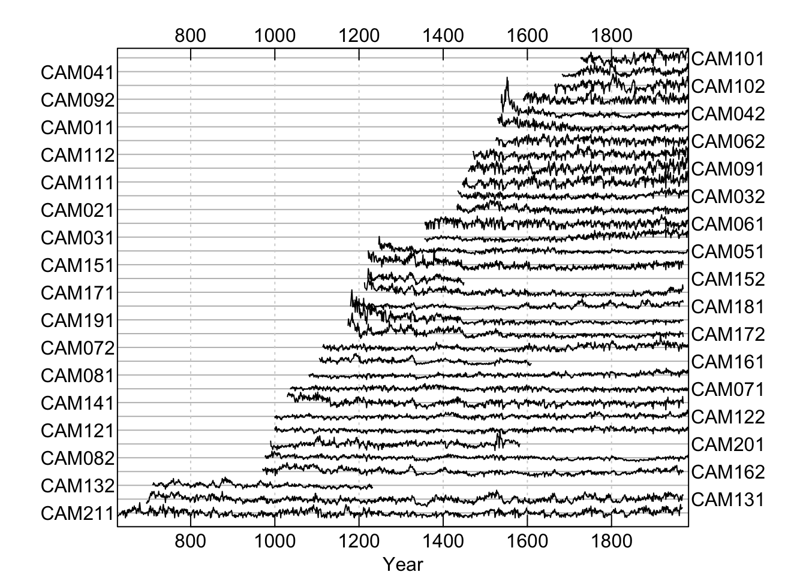
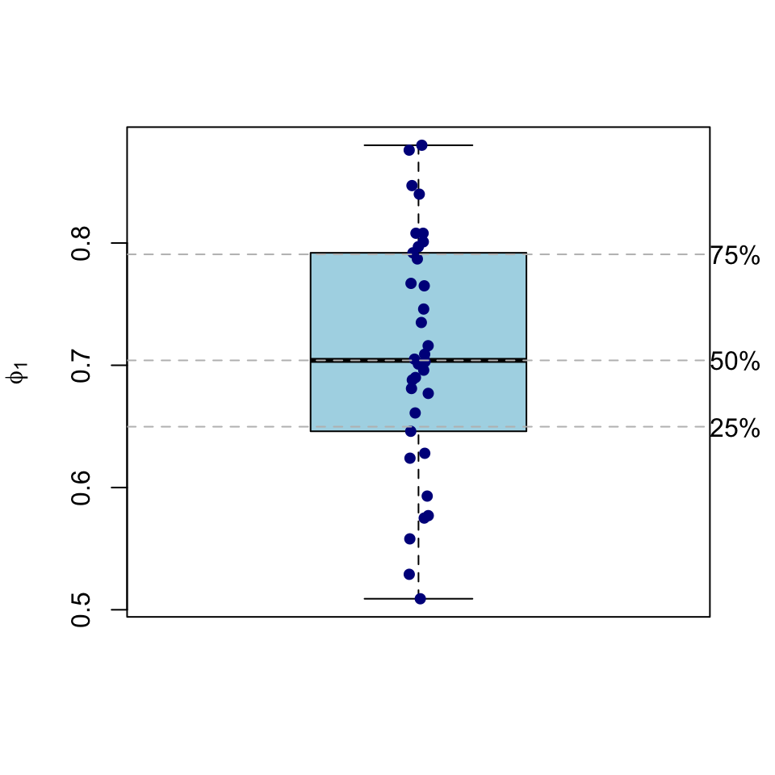
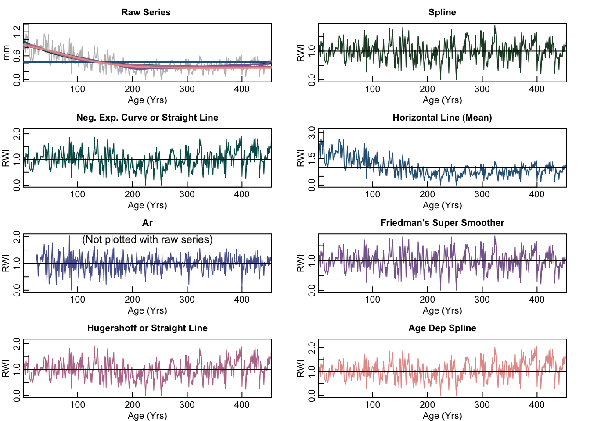
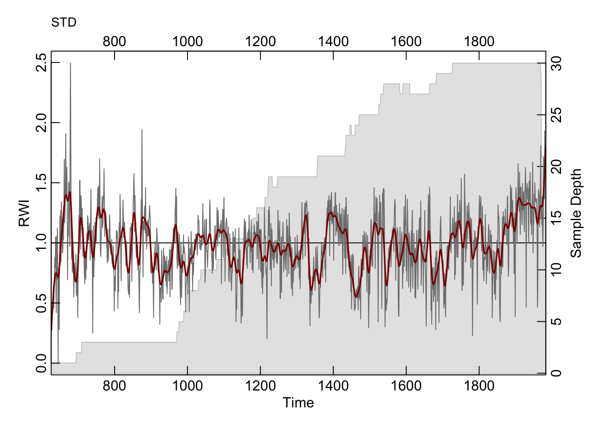

# Using dplR

This document describes basic features of `dplR` by following the initial steps that an analyst might follow when working with a new tree-ring data set. The  document starts with reading in ring widths and plotting them. We describe a few of the available methods for detrending and then show how to extract basic descriptive statistics. We show how to build and plot a simple  mean-value chronology. We also show how to build a chronology  using the expressed population signal from the detrended ring widths as an example of how more complicated analysis can be done using `dplR`.

## What is Covered

The Dendrochronology Program Library in R (`dplR`) is a package for  dendrochronologists to handle data processing and analysis. This document gives just a brief introduction of some of the most commonly used functions in `dplR`. There is more detailed information available in the help files and in the literature [@Bunn2008]. 

In this document, we will walk through the most basic activities of working  with tree-ring data in roughly the order that a user might follow. E.g.,  reading data, detrending, chronology building, and doing preliminary  exploratory data analysis via descriptive statistics.

### Load dplR

We will be using `dplR` in here. Load it:


```r
library(dplR)
```

```
## This is dplR version 1.7.3.
## New users can visit https://opendendro.github.io/dplR-workshop/ to get started.
```


## Working with Ring-Width Data

### Reading Data

There are many ways that tree-ring data are digitally stored. These range in sophistication from the simple (and commonly used) [Tucson/decadal](http://www1.ncdc.noaa.gov/pub/data/paleo/treering/treeinfo.txt) format file of ring widths to the more complex (but richer) [TRiDaS format](http://www.tridas.org/). The type of data used most often by dendrochronologists is a series of ring widths from tree cores. We generally refer to these as  `rwl` objects for "ring width length" but there is no reason these cannot be other types of tree-ring data (e.g., density).

The workhorse function for getting tree-ring data into R is dplR's `read.rwl` function. This function reads files in `"tucson"`, `"compact"`, `"tridas"`, and `"heidelberg"` formats. The on-board `rwl` data sets in `dplR` (i.e., `co021`, `ca533`, `gp.rwl`) were all imported into R using this function.

Throughout this document we will use the on-board data set  `ca533` which gives the raw ring widths for bristlecone pine *Pinus longaeva* at Campito Mountain in California, USA. There are 34 series spanning 1358 years. 

These objects are structured very simply as a `data.frame` with the series in columns and the years as rows. The series IDs are the column names and the years are the row names (both stored as characters). For instance, using the Campito Mountain ring widths we can load the data and learn some basic things about it:


```r
data(ca533) # the result of ca533 <- read.rwl('ca533.rwl')
nrow(ca533) # 1358 years
```

```
## [1] 1358
```

```r
ncol(ca533) # 34 series
```

```
## [1] 34
```

We can look a little deeper at this object (`ca533`) and get the series names as well as look at the time values associates with the data:


```r
colnames(ca533) # the series IDs
```

```
##  [1] "CAM011" "CAM021" "CAM031" "CAM032" "CAM041" "CAM042" "CAM051" "CAM061"
##  [9] "CAM062" "CAM071" "CAM072" "CAM081" "CAM082" "CAM091" "CAM092" "CAM101"
## [17] "CAM102" "CAM111" "CAM112" "CAM121" "CAM122" "CAM131" "CAM132" "CAM141"
## [25] "CAM151" "CAM152" "CAM161" "CAM162" "CAM171" "CAM172" "CAM181" "CAM191"
## [33] "CAM201" "CAM211"
```

```r
head(time(ca533),n = 10) # the first 10 years
```

```
##  [1] 626 627 628 629 630 631 632 633 634 635
```

### Describing and Plotting Ring-Width Data

Once a `rwl` data set has been read into R, there are a variety of ways to describe and visualize those data. Take note that this object is stored both as a generic `data.frame` in R but it also is part of a special class called `rwl` which will let R know how to do some special things with it like summarize and plot the data: 


```r
class(ca533) 
```

```
## [1] "rwl"        "data.frame"
```

Thus, we can plot a `rwl` object by showing either the segments arranged over time as straight lines or as a "spaghetti plot". The `rwl` objects have generic S3 methods for `plot` and `summary` meaning that `R` knows how to do something special when `plot` or `summary` are invoked on an object with class `rwl`. E.g.,:


```r
plot(ca533, plot.type="spag")
```




## Descriptive Statistics

The simplest report on a `rwl` object can be print to the screen via:

```r
rwl.report(ca533)
```

```
## Number of dated series: 34 
## Number of measurements: 23276 
## Avg series length: 684.6 
## Range:  1358 
## Span:  626 - 1983 
## Mean (Std dev) series intercorrelation: 0.6294 (0.08593)
## Mean (Std dev) AR1: 0.7093 (0.09812)
## -------------
## Years with absent rings listed by series 
##     Series CAM011 -- 1753 1782 
##     Series CAM031 -- 1497 1500 1523 1533 1540 1542 1545 1578 1579 1580 1655 1668 1670 1681 
##     Series CAM032 -- 1497 1523 1579 1654 1670 1681 1782 
##     Series CAM051 -- 1475 
##     Series CAM061 -- 1497 1523 1542 1545 1547 1579 1654 1655 1668 1670 1672 1782 1858 1960 
##     Series CAM062 -- 1542 1545 1547 1548 1579 1654 1655 1670 1672 1782 1836 1857 1858 1929 
##     Series CAM071 -- 1269 1497 1498 1523 1542 1547 1578 1579 1612 1655 1656 1668 1670 1672 1674 1690 1707 1708 1756 1782 1795 1820 1836 1845 1857 1858 1924 1948 1960 
##     Series CAM072 -- 1218 1497 1498 1523 1533 1538 1542 1545 1546 1547 1571 1579 1580 1590 1654 1655 1668 1670 1672 1675 1690 
##     Series CAM081 -- 1218 1336 
##     Series CAM082 -- 1362 1858 1865 
##     Series CAM091 -- 1655 1669 1670 1782 1858 
##     Series CAM092 -- 1624 1654 1655 1670 1672 1675 1677 1690 1703 1705 1707 1708 1710 1733 1753 1756 1757 1774 1777 1781 1782 1783 1784 1795 1807 1824 1829 1836 1845 1857 1858 1899 1904 1929 1936 1961 
##     Series CAM101 -- 1782 1783 1899 1929 
##     Series CAM102 -- 1669 1690 1782 1858 1899 1929 
##     Series CAM111 -- 1542 
##     Series CAM112 -- 1542 
##     Series CAM121 -- 1093 1218 1254 1361 1365 1460 1462 1468 1473 1475 1492 1497 1542 1544 1545 1547 1600 1899 1960 
##     Series CAM122 -- 1117 1133 1147 1177 1218 1254 1361 1475 1497 1670 
##     Series CAM131 -- 1361 
##     Series CAM151 -- 1670 1703 
##     Series CAM161 -- 1523 
##     Series CAM162 -- 1618 1624 1641 
##     Series CAM181 -- 1450 1523 
##     Series CAM191 -- 1475 1497 1523 1533 1542 1558 1571 1578 1618 1655 1668 1670 1675 1677 1690 1705 1777 1929 
##     Series CAM201 -- 1523 
##     Series CAM211 -- 645 762 809 847 924 957 1014 1118 1123 1133 1147 1189 1350 1384 1468 1571 1641 
## 234 absent rings (1.005%)
## -------------
## Years with internal NA values listed by series 
##     None
```

That's pretty basic information. We can look at some common (and not-so common) descriptive statistics of a `rwl` object:


```r
ca533.stats <- summary(ca533) # same as calling rwl.stats(ca533)
head(ca533.stats,n=5) # look at the first five series
```

```
##   series first last year  mean median stdev  skew  gini   ar1
## 1 CAM011  1530 1983  454 0.440   0.40 0.222 1.029 0.273 0.696
## 2 CAM021  1433 1983  551 0.424   0.40 0.185 0.946 0.237 0.701
## 3 CAM031  1356 1983  628 0.349   0.29 0.214 0.690 0.341 0.808
## 4 CAM032  1435 1983  549 0.293   0.26 0.163 0.717 0.309 0.661
## 5 CAM041  1683 1983  301 0.526   0.53 0.223 0.488 0.238 0.690
```

These are common summary statistics like mean, median, etc. but also statistics that are more specific to dendrochronology like the first-order autocorrelation (`ar1`), gini (`gini`), and mean sensitivity (`sens1` and `sens2`). **We would be remiss if we did not here mention that mean sensitivity is actually a terrible statistic that should rarely, if ever, be used [@Bunn2013].** Note that output object `ca533.stats` is itself a `data.frame` and its data can be used to plot, etc.

For instance, we can look at the spread of the first-order autocorrelation via `summary(ca533.stats$ar1)` or make a plot to show the data. Here we will demonstrate a somewhat involved plot to get you an idea of how to layer plotting commands:


```r
boxplot(ca533.stats$ar1,ylab=expression(phi[1]),col = "lightblue")
stripchart(ca533.stats$ar1, vertical = TRUE,  
    method = "jitter", jitter = 0.02,add = TRUE, pch = 20, col = 'darkblue',cex=1.25)
ar1Quant <- quantile(ca533.stats$ar1,probs = c(0.25,0.5,0.75))
abline(h=ar1Quant,lty="dashed",col="grey")
mtext(text = names(ar1Quant),side = 4,at = ar1Quant,las=2)
```



Quick editorial note. I've switched from base R plotting to using `ggplot` in most all of my work. I need to go through and provide new plotting examples for everything, but time is short. Real quick though, here is a `ggplot`


```r
library(ggplot2)
ar1 <- data.frame(x="CA 533",y=ca533.stats$ar1)
ggplot(ar1,aes(x,y)) + geom_boxplot(width=.2) +
  geom_jitter(width=0.1) + 
  labs(y=expression(phi[1]),x=element_blank()) +
  theme_minimal()
```


## Detrending

Analysts often (but not always) detrend a `rwl` data set to create an object containing ring-width index (`rwi`) values. The `dplR` package contains most standard detrending methods including detrending via splines, fitting negative exponential curves, and so on. There are also `dplR` functions for less commonly used detrending methods like regional curve and signal-free standardization.

A `rwi` object has the same basic properties as the `rwl` object from which it is made. I.e., it has the same number of rows and columns, the same names, and so on. The difference is that each series has been standardized by dividing the ring widths against a growth model (e.g., a stiff spline, a negative  exponential, etc.). This gives each series a mean of one (thus referred to as "indexed") and allows a chronology to be built (next section). As `read.rwl` is the primary function for getting data into R,  `detrend` is the primary function for standardizing `rwl` objects (but see `cms`, `rcs`, `bai.in`, and  `bai.out` as well).

### Common Detrending Methods

As any dendrochronologist will tell you, detrending is a dark art. In `dplR` we have implemented some of the standard tools for detrending but all have drawbacks. In all of the methods, the detrending is the estimation and removal of the low frequency variability that is due to biological or stand  effects. The standardization is done by dividing each series by the growth  trend to produce units in the dimensionless ring-width index (RWI). Much of the text that follows is modified from the help page of `detrend`.

Probably the most common method for detrending is what is often called the "conservative" approach of attempting to fit a negative exponential curve to a series. In the `dplR` implementation the `"ModNegExp"` method of `detrend` attempts to fit a classic nonlinear model of biological growth of the form $(f(t) = a \times \mathrm{e}^{bt} + k)$, where the argument of the function is time, using `nls`. See Fritts [-@Fritts2001] for details about the parameters. If a suitable nonlinear model cannot be fit (function is non-decreasing or some values are not positive) then a linear model is fit using `lm`. That linear model can have a positive slope unless `pos.slope` is `FALSE` in which case the series is standardized by its mean (method `"Mean"` in `detrend`).

For instance, every series in the `ca533` object can be detrended at once via:  


```r
ca533.rwi <- detrend(rwl = ca533, method = "ModNegExp")
```

This saves the results in `ca533.rwi` which is a `data.frame` with the same dimensions as the `rwl` object `ca533` and each series standardized.

```r
nrow(ca533.rwi) # 1358 years
```

```
## [1] 1358
```

```r
ncol(ca533.rwi) # 34 series
```

```
## [1] 34
```

```r
colMeans(ca533.rwi, na.rm=TRUE)
```

```
## CAM011 CAM021 CAM031 CAM032 CAM041 CAM042 CAM051 CAM061 CAM062 CAM071 CAM072 
## 0.9996 1.0000 1.0000 1.0000 1.0000 1.0012 1.0002 0.9999 1.0000 1.0000 1.0000 
## CAM081 CAM082 CAM091 CAM092 CAM101 CAM102 CAM111 CAM112 CAM121 CAM122 CAM131 
## 1.0000 1.0000 1.0000 0.9996 1.0000 1.0000 1.0000 1.0000 1.0000 1.0000 0.9998 
## CAM132 CAM141 CAM151 CAM152 CAM161 CAM162 CAM171 CAM172 CAM181 CAM191 CAM201 
## 0.9985 0.9999 0.9995 0.9999 1.0004 0.9994 0.9997 0.9998 1.0000 0.9953 1.0000 
## CAM211 
## 0.9998
```

When `detrend` is run on a `rwl` object the function loops through 
each series. It does this by calling a different function 
(`detrend.series`) for each column in the `rwl` object. 
But, a user can also call `detrend.series` and it is useful to do so here 
for educational purposes.

Let us detrend a single series and apply more than one detrending method when we call the detrend function. We will call `detrend.series` using the verbose mode so that we can see the parameters applied for each method. The `detrend.series` function produces a plot by default.


```r
CAM011.rwi <- detrend.series(y = ca533[, "CAM011"],verbose=TRUE)
```

```
##  ~~~~~~~~~~~~~~~~~~~~~~~~~~~~~~~~~~~~~~~~~~~~~~~~~~~~~~~~~~~~~~~~~~~~~~~~~~~~~~
## Verbose output: 
## 
##  ~~~~~~~~~~~~~~~~~~~~~~~~~~~~~~~~~~~~~~~~~~~~~~~~~~~~~~~~~~~~~~~~~~~~~~~~~~~~~~
##  Options
##  make.plot      TRUE
##  method(s)1     c("Spline", "ModNegExp", "Mean", "Ar", "Friedman", "ModHugershoff", 
##  method(s)2     "AgeDepSpline")
##  nyrs           NULL
##  f              0.5
##  pos.slope      FALSE
##  constrain.nls  never
##  verbose        TRUE
##  return.info    FALSE
##  wt             default
##  span           cv
##  bass           0
##  difference     FALSE
## 
##  ~~~~~~~~~~~~~~~~~~~~~~~~~~~~~~~~~~~~~~~~~~~~~~~~~~~~~~~~~~~~~~~~~~~~~~~~~~~~~~
##  Zero indices in input series:
##  1128 1157
## 
##  ~~~~~~~~~~~~~~~~~~~~~~~~~~~~~~~~~~~~~~~~~~~~~~~~~~~~~~~~~~~~~~~~~~~~~~~~~~~~~~
##  Detrend by ModNegExp.
##  Trying to fit nls model...
##  nls coefs
##  a:  0.66110
##  b: -0.01184
##  k:  0.31793
## 
##  ~~~~~~~~~~~~~~~~~~~~~~~~~~~~~~~~~~~~~~~~~~~~~~~~~~~~~~~~~~~~~~~~~~~~~~~~~~~~~~
##  Detrend by ModHugershoff.
##  Trying to fit nls model...
##  nls coefs
##  a: 0.45550
##  b: 0.15420
##  g: 0.01532
##  d: 0.32392
## 
##  ~~~~~~~~~~~~~~~~~~~~~~~~~~~~~~~~~~~~~~~~~~~~~~~~~~~~~~~~~~~~~~~~~~~~~~~~~~~~~~
##  Detrend by age-dependent spline.
##  Spline parameters
##  nyrs = 50, pos.slope = FALSE
## 
##  ~~~~~~~~~~~~~~~~~~~~~~~~~~~~~~~~~~~~~~~~~~~~~~~~~~~~~~~~~~~~~~~~~~~~~~~~~~~~~~
##  Detrend by spline.
##  Spline parameters
##  nyrs = 304, f = 0.5
## 
##  ~~~~~~~~~~~~~~~~~~~~~~~~~~~~~~~~~~~~~~~~~~~~~~~~~~~~~~~~~~~~~~~~~~~~~~~~~~~~~~
##  Detrend by mean.
##  Mean =  0.4396
## 
##  ~~~~~~~~~~~~~~~~~~~~~~~~~~~~~~~~~~~~~~~~~~~~~~~~~~~~~~~~~~~~~~~~~~~~~~~~~~~~~~
##  Detrend by prewhitening.
## Call:
## ar(x = y[idx.goody])
## 
## Coefficients:
##      1       2       3       4       5       6       7       8       9      10  
##  0.388   0.139   0.000   0.084   0.132   0.061   0.038  -0.126   0.037  -0.100  
##     11      12      13      14      15      16      17      18      19      20  
## -0.010   0.015   0.088   0.010   0.064  -0.013   0.015  -0.004  -0.054   0.124  
##     21      22      23  
## -0.030  -0.054   0.137  
## 
## Order selected 23  sigma^2 estimated as  0.0209
##  ~~~~~~~~~~~~~~~~~~~~~~~~~~~~~~~~~~~~~~~~~~~~~~~~~~~~~~~~~~~~~~~~~~~~~~~~~~~~~~
##  Fits from method=='Ar' are not all positive. 
##   Setting values <0 to 0.  
##   This might not be what you want. 
##   ARSTAN would tell you to plot that dirty dog at this point. 
##   Proceed with caution.
##  ~~~~~~~~~~~~~~~~~~~~~~~~~~~~~~~~~~~~~~~~~~~~~~~~~~~~~~~~~~~~~~~~~~~~~~~~~~~~~~
## 
##  ~~~~~~~~~~~~~~~~~~~~~~~~~~~~~~~~~~~~~~~~~~~~~~~~~~~~~~~~~~~~~~~~~~~~~~~~~~~~~~
##  Detrend by Friedman's super smoother.
##  Smoother parameters
##  span = cv, bass = 0
##  wt = default
## 
##  ~~~~~~~~~~~~~~~~~~~~~~~~~~~~~~~~~~~~~~~~~~~~~~~~~~~~~~~~~~~~~~~~~~~~~~~~~~~~~~
##  Zero indices in Ar series:
##  993
```



Note that advanced users can use `return.info=TRUE` to have all the curve-fitting parameters returned in a `list`. Having access to these curves is occasionally desirable. Also, sometimes a user will want to interactively detrend each series and fit a negative exponential curve to one series, a spline to another, and the mean to a third. This can be done via the `i.detrend` and `i.detrend.series` functions. See their help pages for details. Users can also power transform tree-ring data (`powt`) and detrend via subtraction instead of division using `detrend` and `detrend.series`.

### Other Detrending Methods

There are other detrending methods that are less commonly used but might have theoretical advantages. These include regional curve standardization (function `rcs`), C-Method Standardization (function `cms`), and converting measurements of ring widths to basal area increment (functions  `bai.in` and `bai.out`). See their help pages for further information.

## Descriptive Statistics for Detrended Data

It is also easy in `dplR` to compute commonly used descriptive statistics that describe the correlation between series (both within and between tree correlations) as well as the expressed population signal, signal-to-noise ratio, and subsample signal strength for a data set. These are done in `dplR` using the `rwi.stats` function so-named because these statistics are typically (but not always) carried out on detrended and standardized ring widths (rwi). If a data set has more than one core taken per tree this information can be used in the calculations to calculate within vs. between tree correlation. The function `read.ids` is used to identify which trees have multiple cores. 


```r
ca533.ids <- read.ids(ca533, stc = c(3, 2, 1))
rwi.stats(ca533.rwi, ca533.ids, prewhiten=TRUE)
```

```
##   n.cores n.trees  n n.tot n.wt n.bt rbar.tot rbar.wt rbar.bt c.eff rbar.eff
## 1      34      21 21   523   13  510    0.444   0.603   0.439 1.448    0.501
##     eps   snr
## 1 0.955 21.09
```

There is (at least) one other way of looking at the average interseries correlation of a data set. The `interseries.cor` function in `dplR` gives a measure of average interseries correlation that is different from the rbar statistics from `rwi.stats`. In this function, correlations are calculated serially between each tree-ring series and a master chronology built from all the other series in the `rwl` object (leave-one-out principle). The average of those correlations is sometimes called the "overall interseries correlation" or even the "COFECHA correlation" in reference to commonly used crossdating software COFECHA. This number is typically higher than the various rbar values given by  `rwi.stats`. We are showing just the first five series and the mean for all series here:


```r
ca533.rho <- interseries.cor(ca533.rwi, prewhiten=TRUE,
                             method="spearman")
ca533.rho[1:5, ]
```

```
##        res.cor p.val
## CAM011  0.5358     0
## CAM021  0.6760     0
## CAM031  0.5258     0
## CAM032  0.6265     0
## CAM041  0.4907     0
```

```r
mean(ca533.rho[, 1])
```

```
## [1] 0.6368
```

Again, if these concepts are unknown to you statistically look at some of the canonical works in dendrochronology like @Cook1990, @Fritts2001, and @Hughes2011.

## Building a Mean-Value Chronology

After detrending, a user will typically build a chronology by averaging across the years of the rwi object. In `dplR` the function for doing this is `chron` which by default uses Tukey's biweight robust mean (an average that is unaffected by outliers).


```r
ca533.crn <- chron(ca533.rwi)
```

This object has the same number of rows as the rwi object that was used as the input and two columns. The first gives the chronology and the second the sample depth (the number of series available in that year).


```r
dim(ca533.rwi)
```

```
## [1] 1358   34
```

```r
dim(ca533.crn)
```

```
## [1] 1358    2
```

An object produced by `chron` has a generic S3 method for plotting which calls the `crn.plot` function (which has many arguments for customization). Here we will just make a simple plot of the chronology with a smoothing spline (function `caps`) added.


```r
plot(ca533.crn, add.spline=TRUE, nyrs=20)
```



The `chron` function is the most basic (and most common) way to buld a chronology but there are many other ways as we will see in the next few chapters.

## Conclusion

In general this page aims to give a very cursory overview of basic tasks that most dendrochronologists will want to be aware of. Know that we are just scratching the surface of what `dplR` is capable of. Browsing the list of functions in `dplR` will give you an idea of what else is available.


```r
?dplR
```

