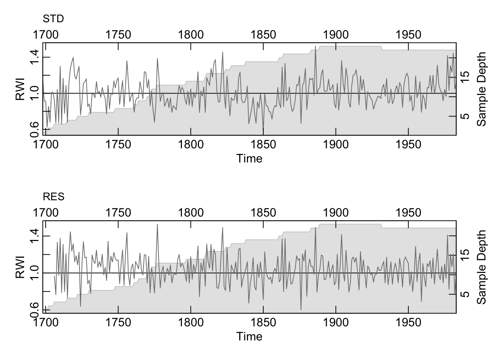
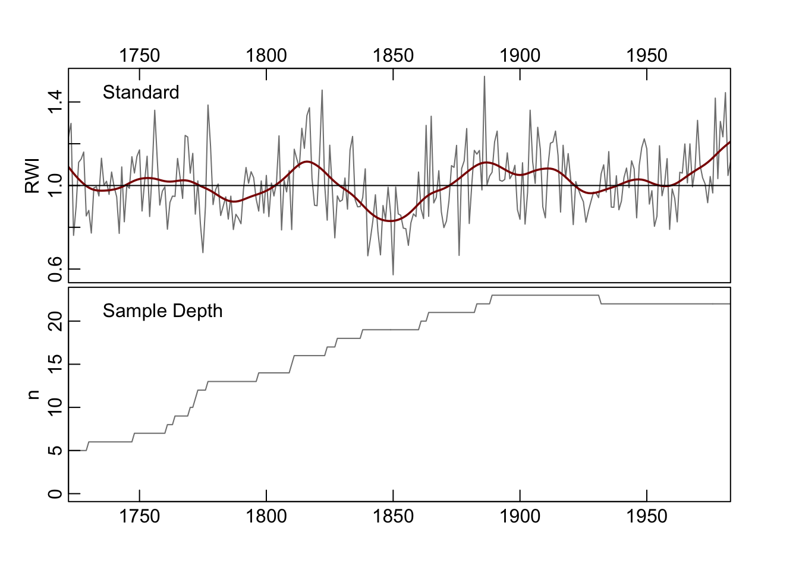
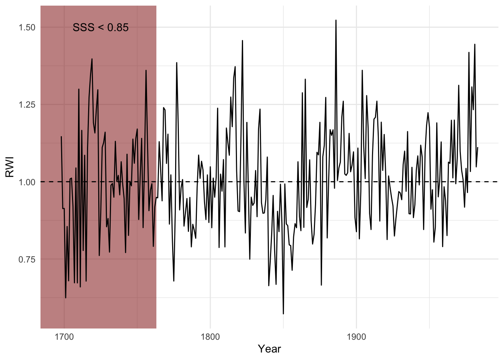
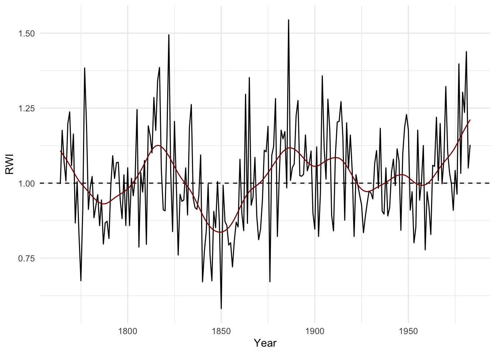
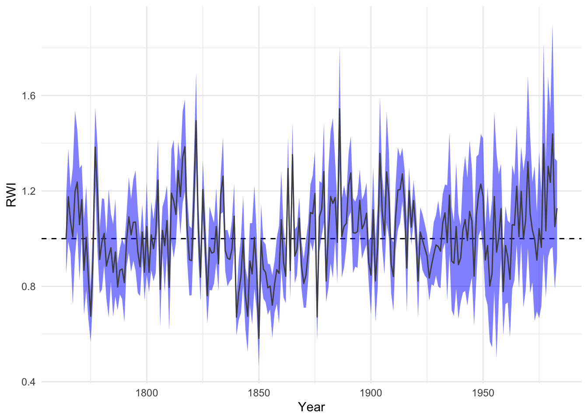

# Chronology Building


## Introduction

The creation of a mean-value chronology is one of the central tasks for a dendrochronologist. It's most commonly done by calculating the mean of each year across all the series in the data. However, there are several more ways to approach the problem and this document explains a few different ways of going about it.

The use of the signal-free method of chronology building with `ssf` is complex enough to warrant its own chapter.

## Data Sets
Throughout this document we will use the onboard data set `wa082` which gives the raw ring widths for Pacific silver fir *Abies amabilis* at Hurricane Ridge in Washington, USA. There are 23 series covering 286 years.


```r
library(dplR)
```

```
## This is dplR version 1.7.4.
## dplR is part of openDendro https://opendendro.org.
## New users can visit https://opendendro.github.io/dplR-workshop/ to get started.
```

```r
data(wa082)
plot(wa082, plot.type="spag")
```


By the way, if this is all new to you -- go back and look at earlier chapters and  proceed immediately to a good primer on dendrochronology like Fritts [-@Fritts2001]. 


## Traditional Chronology
Let us make a few chronologies from the `wa082` data after detrending each series with an age-dependent spline (using `ads`). Detrending is an enormously complicated
area unto itself and more deserving of a chapter than chronology building is. We over some of the issues around detrending in the prior chapter. There is a reason, 
after all, that dendrochronologists have been arguing about detrending for decades.


```r
wa082RWI <- detrend(wa082, method="AgeDepSpline")
```

The simplest way to make a chronology in `dplR` is chronology is with the `chron`
function which also has a `plot` method. This defaults to building a mean-value
chronology by averaging the rows of the `rwi` data using Tukey's biweight robust
mean (function `tbrm`). Here it is with a a 30-year smoothing spline for visualization.


```r
wa082Crn <- chron(wa082RWI)
str(wa082Crn)
```

```
## Classes 'crn' and 'data.frame':	286 obs. of  2 variables:
##  $ std       : num  1.147 0.913 0.914 0.624 0.855 ...
##  $ samp.depth: num  1 1 1 1 2 2 2 2 3 3 ...
```

```r
plot(wa082Crn, add.spline=TRUE, nyrs=30)
```


Note the structure (`str`) of the output object states that it is `class` `crn`. This means that there are some generic functions that `dplR` has ready to work with this kind of object (e.g., `time` to extract the years, and `plot` which then calls `crn.plot`).

The `chron` function will also compute a residual chronology by prewhitening the series before averaging. If the `prewhiten` flag is set to `TRUE`, each series is whitened using `ar` prior to averaging. The residual chronology is thus white noise. Note that the `crn` object below has two columns with chronologies as well as the sample depth in a third column. 


```r
wa082CrnResid <- chron(wa082RWI, prewhiten = TRUE)
str(wa082CrnResid)
```

```
## Classes 'crn' and 'data.frame':	286 obs. of  3 variables:
##  $ std       : num  1.147 0.913 0.914 0.624 0.855 ...
##  $ res       : num  NA NA NA NA NA ...
##  $ samp.depth: num  1 1 1 1 2 2 2 2 3 3 ...
```

```r
plot(wa082CrnResid)
```




## Using a Sample Depth Cutoff

A relatively simple addition to the traditional chronology is to truncate the
chronology when the sample depth gets to a certain threshold. The output from
the `chron` function contains a column called `samp.depth` which shows the
number of series that are average for a particular year. We can use the 
`subset` function to modify the chronology. A standard method is to truncate the sample depth to a minimum of five series.


```r
head(wa082Crn)
```

```
##         std samp.depth
## 1698 1.1472          1
## 1699 0.9133          1
## 1700 0.9135          1
## 1701 0.6244          1
## 1702 0.8551          2
## 1703 0.6795          2
```

```r
wa082CrnTrunc <- subset(wa082Crn, samp.depth > 4)
plot(wa082CrnTrunc,add.spline=T,nyrs=30)
```



It would likely be more robust to recalculate the ring-width indices object by truncating the `rwl` file and then making a chronology which could be done by nesting commands via:


```r
wa082CrnTrunc <- chron(detrend(wa082[wa082Crn$samp.depth > 4,], 
                               method="AgeDepSpline"))
```

The result in this case is likely to be virtually identical to truncating after calculating the chronology but still seems like a good practice.


## Using SSS as a Cutoff

A more interesting and likely more robust approach is to truncate via the
subsample signal strength (SSS). Just for fun, I'll show how we can do this using `tidy` syntax and `ggplot`.


```r
library(tidyverse)
```

```
## ── Attaching packages ─────────────────────────────────────── tidyverse 1.3.1 ──
```

```
## ✓ ggplot2 3.3.5     ✓ purrr   0.3.4
## ✓ tibble  3.1.6     ✓ dplyr   1.0.8
## ✓ tidyr   1.2.0     ✓ stringr 1.4.0
## ✓ readr   2.1.2     ✓ forcats 0.5.1
```

```
## ── Conflicts ────────────────────────────────────────── tidyverse_conflicts() ──
## x dplyr::filter() masks stats::filter()
## x dplyr::lag()    masks stats::lag()
```

```r
wa082Ids <- autoread.ids(wa082)
sssThresh <- 0.85
wa082SSS <- sss(wa082RWI, wa082Ids)
yrs <- time(wa082)
yrCutoff <- max(yrs[wa082SSS < sssThresh])
ggplot() +
  geom_rect(aes(ymin=-Inf, ymax=Inf,xmin=-Inf,xmax=yrCutoff),
            fill="darkred",alpha=0.5) +
  annotate(geom = "text",y=1.5,x=1725,label="SSS < 0.85")+
  geom_hline(yintercept = 1,linetype="dashed") +
  geom_line(aes(x=yrs,y=wa082Crn$std)) +
  labs(x="Year",y="RWI") + theme_minimal()
```



Now we can cutoff the `rwl` data and redo the chronology.


```r
wa082RwlSSS <- wa082[wa082SSS > sssThresh,]
wa082RwiSSS <- detrend(wa082RwlSSS, method="AgeDepSpl")

wa082CrnSSS <- chron(wa082RwiSSS)
ggplot() +
  geom_hline(yintercept = 1,linetype="dashed") +
  geom_line(aes(x=time(wa082CrnSSS),y=wa082CrnSSS$std)) +
  geom_line(aes(x=time(wa082CrnSSS),
                y=caps(wa082CrnSSS$std,nyrs = 30)),
            color="darkred") +
  labs(x="Year",y="RWI") + theme_minimal()
```




## Chronology Uncertainty
Typically we calculate a chronology by taking the average of each year from the ring-width indices. And that is typically the biweight robust mean. The function `chron` like  many of the functions in `dplR` are relatively simple chunks of code that are used for convenience. We can make our own chronology and get the mean plus two standard errors of the yearly growth quite simply. It's important for new users of `dplR` not to get stuck with just the available functions and to roll your own code.


```r
wa082AvgCrn <- apply(wa082RwiSSS,1,mean,na.rm=TRUE)
se <- function(x){
  x2 <- na.omit(x)
  n <- length(x2)
  sd(x2)/sqrt(n)
}
wa082AvgCrnSE <- apply(wa082RwiSSS,1,se)

dat <- data.frame(yrs =as.numeric(names(wa082AvgCrn)), 
                  std = wa082AvgCrn,
                  lwr = wa082AvgCrn - wa082AvgCrnSE*2,
                  upr = wa082AvgCrn + wa082AvgCrnSE*2)
ggplot(dat,aes(x=yrs)) +
  geom_hline(yintercept = 1,linetype="dashed") +
  geom_ribbon(aes(ymin=lwr,ymax=upr),
              alpha=0.5,fill="blue") +
  geom_line(aes(y=std),col="grey30") +
  labs(x="Year",y="RWI") + theme_minimal()
```


It is interesting to note how the uncertainty increases towards the end of the chronology. This is somewhat unusual.

### Bootstrapping confidence intervals
The above method uses a parametric approach to quantifying uncertainty. We can also use the `boot` library which is an incredibly powerful suite of functions for using resampling techniques to  calculate almost any imaginable statistic. Although `boot` and is used ubiquitously throughout R, its syntax is byzantine. Because of that we have created a wrapper for the `boot.ci` function will generate a mean-value chronology with bootstrapped confidence intervals. Here is a chronology using the `wa082RwiSSS` again but with 99% confidence intervals around the robust mean generated with 500 boostrap replicates.


```r
wa082CrnCI <- chron.ci(wa082RwiSSS, biweight = TRUE, R = 500, conf = 0.99)
head(wa082CrnCI)
```

```
##       yrs    std lowerCI upperCI samp.depth
## 1764 1764 0.9974  0.8514   1.162          9
## 1765 1765 1.1763  0.9871   1.377          9
## 1766 1766 1.0711  0.9369   1.212          9
## 1767 1767 1.0074  0.7237   1.296          9
## 1768 1768 1.1974  0.9280   1.536          9
## 1769 1769 1.2375  1.0293   1.457          9
```

```r
ggplot(wa082CrnCI,aes(x=yrs)) +
  geom_hline(yintercept = 1,linetype="dashed") +
  geom_ribbon(aes(ymin=lowerCI,ymax=upperCI),
              alpha=0.5,fill="blue") +
  geom_line(aes(y=std),col="grey30") +
  labs(x="Year",y="RWI") + theme_minimal()
```




## The ARSTAN Chronology

The function `chron.ars` produces the so-called ARSTAN chronology which retains the autoregressive structure of the input data. Users unfamiliar with the concept should dive into Cook [-@cook1985]. This produces three mean-value chronologies: standard, residual, and ARSTAN.

The standard chronology is the (biweight) mean value across rows and identical to `chron`. The residual chronology is the prewhitened chronology as described by Cook [-@cook1985] and uses uses multivariate autoregressive modeling to determine the order of the AR process. It's important to note that residual chronology produced here is different than the simple residual chronology produced by `chron` which returns the residuals of an AR process using a naive call to `ar`. But in practice the results will be similar. For more on the residual chronology in this function, see pp. 153-154 in Cook [-@cook1985].

The ARSTAN chronology builds on the residual chronology but returns a re-whitened chronology where the pooled AR coefficients from the multivariate autoregressive modeling are reintroduced.


```r
wa082ArsCrnSSS <- chron.ars(wa082RwiSSS)
```

```
## Pooled AR Summary
## ACF
##  ar(0)  ar(1)  ar(2)  ar(3)  ar(4)  ar(5)  ar(6)  ar(7)  ar(8)  ar(9) ar(10) 
## 1.0000 0.3548 0.3356 0.3073 0.2524 0.2306 0.2201 0.1940 0.2093 0.2107 0.2063 
## AR Coefs
##              1       2       3        4        5        6         7        8
## ar(1)  -0.3548  0.0000  0.0000  0.00000  0.00000  0.00000  0.000000  0.00000
## ar(2)  -0.2697 -0.2399  0.0000  0.00000  0.00000  0.00000  0.000000  0.00000
## ar(3)  -0.2314 -0.1968 -0.1598  0.00000  0.00000  0.00000  0.000000  0.00000
## ar(4)  -0.2197 -0.1825 -0.1429 -0.07294  0.00000  0.00000  0.000000  0.00000
## ar(5)  -0.2156 -0.1744 -0.1326 -0.06051 -0.05657  0.00000  0.000000  0.00000
## ar(6)  -0.2124 -0.1710 -0.1251 -0.05060 -0.04432 -0.05685  0.000000  0.00000
## ar(7)  -0.2105 -0.1695 -0.1234 -0.04655 -0.03878 -0.04997 -0.032391  0.00000
## ar(8)  -0.2084 -0.1663 -0.1209 -0.04357 -0.03087 -0.03911 -0.018905 -0.06406
## ar(9)  -0.2044 -0.1651 -0.1185 -0.04164 -0.02815 -0.03156 -0.008518 -0.05105
## ar(10) -0.2013 -0.1625 -0.1181 -0.04003 -0.02672 -0.02943 -0.002472 -0.04262
##               9       10
## ar(1)   0.00000  0.00000
## ar(2)   0.00000  0.00000
## ar(3)   0.00000  0.00000
## ar(4)   0.00000  0.00000
## ar(5)   0.00000  0.00000
## ar(6)   0.00000  0.00000
## ar(7)   0.00000  0.00000
## ar(8)   0.00000  0.00000
## ar(9)  -0.06245  0.00000
## ar(10) -0.05202 -0.05102
## AIC
##  ar(0)  ar(1)  ar(2)  ar(3)  ar(4)  ar(5)  ar(6)  ar(7)  ar(8)  ar(9) ar(10) 
##   1775   1748   1737   1733   1734   1735   1736   1738   1739   1740   1742 
## Selected Order
## [1] 3
```

```r
str(wa082ArsCrnSSS)
```

```
## Classes 'crn' and 'data.frame':	220 obs. of  4 variables:
##  $ std       : num  0.997 1.176 1.071 1.007 1.197 ...
##  $ res       : num  NaN NaN NaN NA NA ...
##  $ ars       : num  NaN NaN NaN 1.04 1.23 ...
##  $ samp.depth: num  9 9 9 9 9 9 10 10 11 12 ...
```

```r
wa082ArsCrnSSS <- wa082ArsCrnSSS[,3:4]
plot(wa082ArsCrnSSS,add.spline=TRUE,nyrs=20)
```


## Stabalizing the Variance
The function `chron.stabilized` builds a *variance stabilized* mean-value chronology following Frank et al. [-@frank2006]. The code for this function was written by David Frank and adapted for `dplR` by Stefan Klesse. The stabilized chronology accounts for both temporal changes in the interseries correlation and sample depth to produce a mean value chronology with stabilized variance.


```r
wa082StabCrnSSS <- chron.stabilized(wa082RwiSSS,winLength=101)
str(wa082StabCrnSSS) # not class crn
```

```
## 'data.frame':	220 obs. of  2 variables:
##  $ adj.crn   : num  1.02 1.14 1.07 1.02 1.16 ...
##  $ samp.depth: num  9 9 9 9 9 9 10 10 11 12 ...
```

```r
dat <- data.frame(yrs = as.numeric(rownames(wa082StabCrnSSS)), 
                  Chron = wa082StabCrnSSS$adj.crn) %>%
  mutate(Smoothed = caps(Chron,nyrs=20)) %>%
  pivot_longer(cols = -yrs,names_to = "variable", values_to = "msmt")

ggplot(dat,aes(x=yrs,y=msmt,color=variable)) +
  geom_hline(yintercept = 1,linetype="dashed") +
  geom_line() +
  scale_color_manual(values = c("grey","darkred")) +
  labs(x="Year",y="RWI",title="Variable Stabilized Chronology") + 
  theme_minimal() +
  theme(legend.title = element_blank(),legend.position = "bottom") 
```


## Stripping out series by EPS
We want to introduce one other approach that doesn't deal explicitly with chronology building but can be used to build a better chronology. The `strip.rwl` function uses EPS-based chronology stripping  where each series is assessed to see if its inclusion in the chronology improves the EPS [@fowler2003]. If it does not the series is dropped from the `rwl` object. As we will see in this example one series are excluded which causes a modest improvement in EPS. This function was contributed by Christain Zang.


```r
wa082StripRwl <- strip.rwl(wa082, ids = wa082Ids)
```

```
## REMOVE -- Iteration 1: leaving series 712071 out.
## EPS improved from 0.907 to 0.908.
## 
## REMOVE -- Iteration 2: no improvement of EPS. Aborting...
## REINSERT -- Iteration 1: no improvement of EPS. Aborting...
```

```r
wa082StripRwi <- detrend(wa082StripRwl, method="Spline")
wa082StripCrn <- chron(wa082StripRwi)
wa082StripCrn <- subset(wa082StripCrn, samp.depth > 4)
plot(wa082StripCrn, add.spline=TRUE, nyrs=30)
```


## Conclusion
We have tried to introduce a few ways of building chronologies with `dplR` that are either typical (like truncating by sample depth) or less commonly used.  In this chapter we aren't advocating any particular method but trying to get the users familiar with ways of interacting with the objects that `dplR` produces. Once the user understands the data structures the rest of `R` opens up.

Again, we feel that it is important to reiterate that the advantage of using `dplR` is that it gets the analyst to use `R` and thus have access to the 
essentially limitless tool that it provides. Go foRth!
