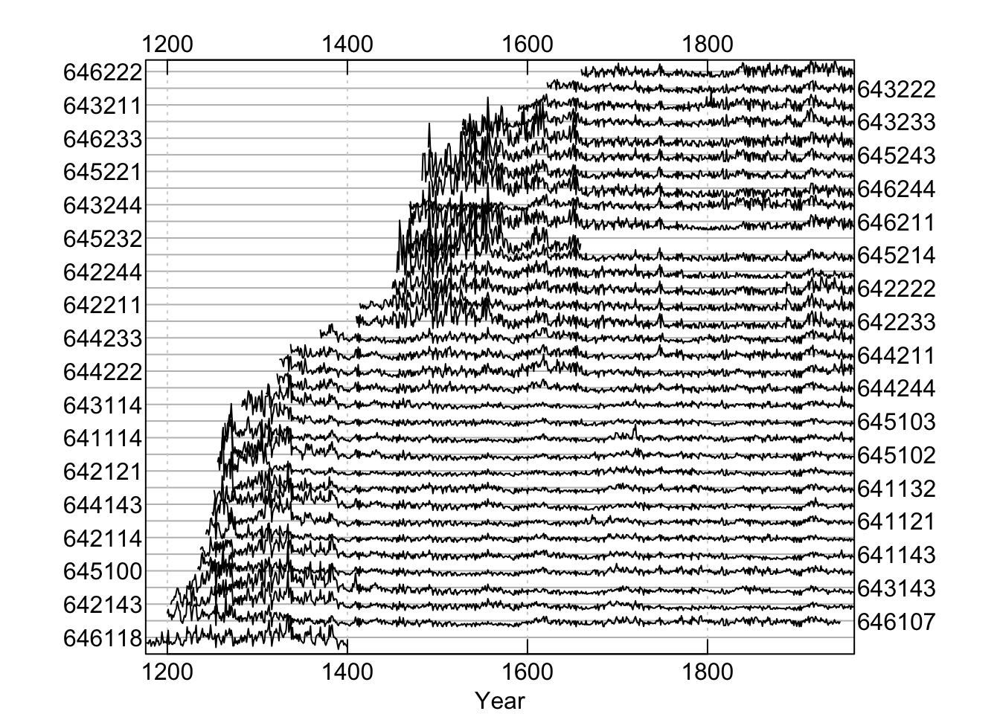
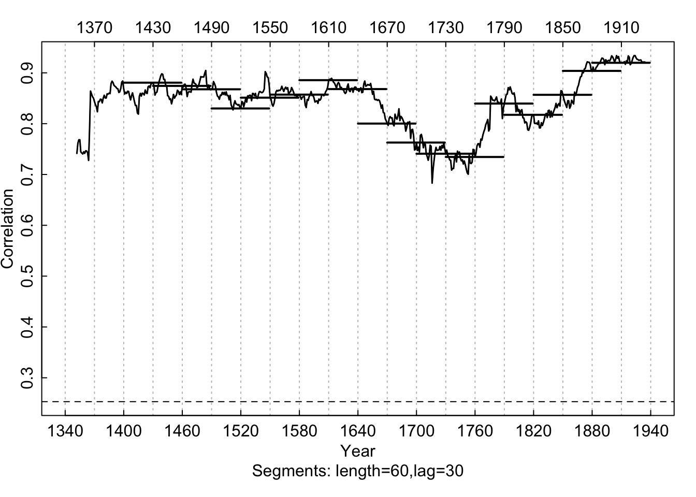
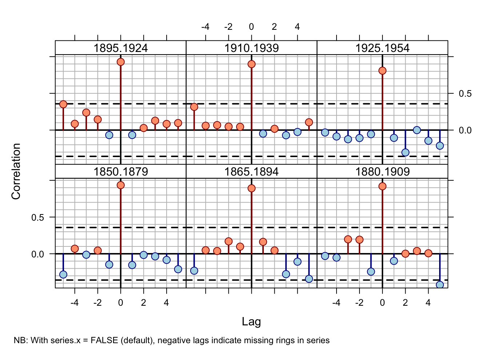
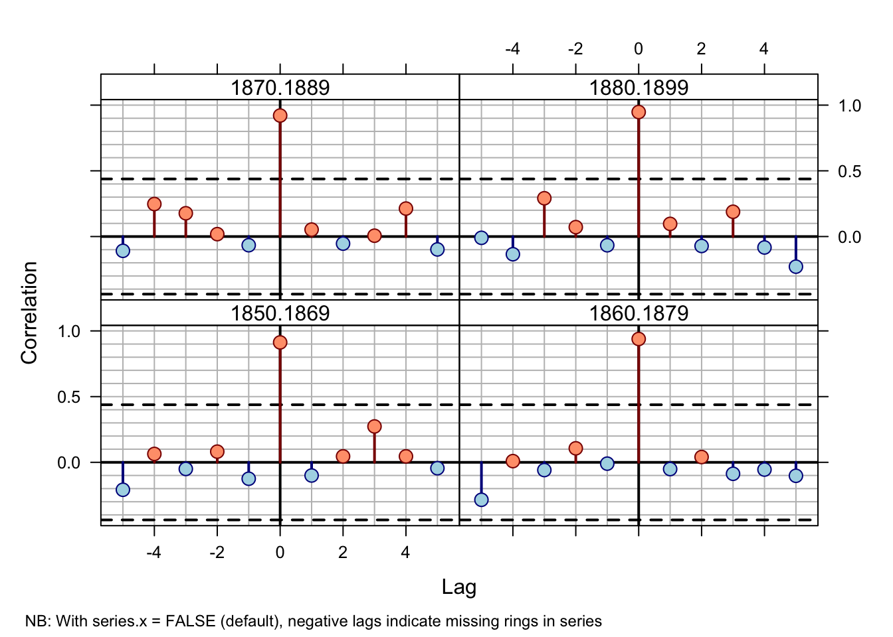
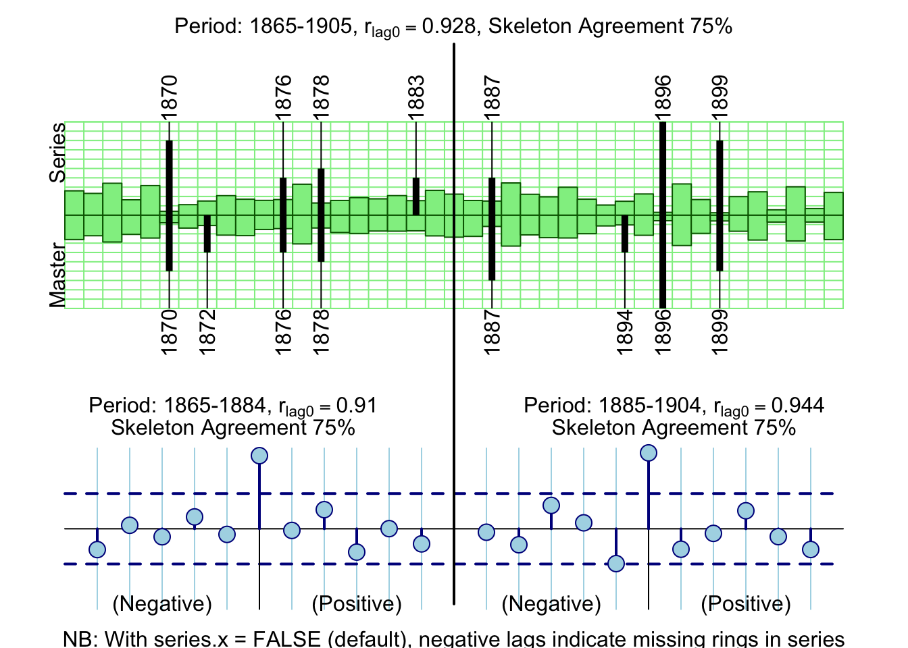

# xDate

In this document we cover basic crossdating techniques in `dplR` by deliberately
misdating one of the series in a well-dated set of ring widths and tracking
down the dating error. As with any dating enterprise, statistical 
crossdating is merely a tool and users should always rely on the wood to
accurately date tree-ring data.

## Introduction

This gives an introduction of some of the crossdating functions in 
dplR. This is essentially a rehashing of [@Bunn2010]. Please
cite that paper if you use dplR for crossdating. There is more detailed 
information on all these functions in the help files. 

## Using the xDater app
Below I'll walk through using `dplR`'s crossdating functions on the command line. But I've also built a Shiny app for doing crossdating in an interactive graphical workflow that is one of the rare cases where an app and GUI are more useful than working in a script. This is definitely still in development and I plan on cleaning it up soon. It's meant to mimic a lot of the look and feel of COFECHA since that's what most folks are used to using. Here it is:

[viz.datascience.arizona.edu/xDateR/](https://viz.datascience.arizona.edu/xDateR/){target="_blank"}

While the xDater app is cool, the [ringdater app](https://ringdater.shinyapps.io/launcher/){target="_blank"} from David Reynolds, David Edge & Bryan Black is also very handy Check that out too.

## Crossdating by hand in dplR

Here is a walk through of using `dplR` for crossdating on the command line.

### Load dplR

We will be using `dplR` in here. Load it:


```r
library(dplR)
```

```
## This is dplR version 1.7.6.
## dplR is part of openDendro https://opendendro.org.
## New users can visit https://opendendro.github.io/dplR-workshop/ to get started.
```

## Ruining a Perfectly Good Data Set

Throughout this document we will use the on-board data set `co021` which gives the raw ring widths for Douglas fir *Pseudotsuga menziesii* at Mesa Verde in Colorado, USA. There are 35 series spanning 788 years. 

We will rename the `co021` object to `dat` because we are going to mess around with it and it seems like good practice to rename it. 


```r
data(co021)
dat <- co021
dat.sum <- summary(dat)
mean(dat.sum$year)
```

```
## [1] 564.9143
```

```r
mean(dat.sum$stdev)
```

```
## [1] 0.3231714
```

```r
mean(dat.sum$median)
```

```
## [1] 0.3211429
```

```r
mean(dat.sum$ar1)
```

```
## [1] 0.6038
```

```r
mean(interseries.cor(dat)[, 1])
```

```
## [1] 0.8477981
```

```r
plot(dat, plot.type="spag")
```



We can see that this is a beautifully sensitive collection with long segment lengths, high standard deviation (relative to ring widths), large first-order autocorrelation, and a high mean interseries correlation ($\mathrm{r}\approx 0.84$).

To demonstrate how crossdating works in `dplR`, we will take this perfectly 
lovely data set and corrupt the dating of one of the series. By doing so we 
will be able to reenact one of the most common tasks of the dendrochronologist:
tracking down a misdated core. Here we will take a random series and remove
one of the years of growth. This simulates a missing ring in the series. We will 
pick a random year in the core to give us a bit of a challenge in finding it.


```r
set.seed(4576)
i <- sample(x=nrow(dat), size=1)
j <- sample(x=ncol(dat), size=1)
tmp <- dat[, j]
tmp <- c(NA, tmp[-i])
dat[, j] <- tmp
```

We have now deleted the $i^{th}$ observation from the $j^{th}$ core while making sure that `dat` still has the appropriate numbers of rows. By sticking the NA at the
start of the series it is as if we missed a ring while measuring.

## Series Correlation by Segment 
The primary function for looking the crossdating of a tree-ring data set in 
dplR is `corr.rwl.seg`. This function looks at the correlation between 
each tree-ring series and a master chronology built from all the other series 
in the rwl object (leave-one-out principle). These correlations are calculated
on overlapping segments (e.g., 50-year segments would be overlapped by 
25 years). By default, each of the series is filtered to remove low-frequency
variation prior to the correlation analysis. The help file has abundant 
details. Here we will look at overlapping 60 year segments. A plot is 
produced by default with `corr.rwl.seg`.

In the `corr.rwl.seg` plot, each segment of each series 
is shown and colored by its correlation with the master. Each series is 
represented by two courses of lines with the bottom course adhering to the 
bottom axis timeline and the top course matching the upper axis timeline. 
Segments are colored according to the strength of the correlation between 
that segment and the master chronology. Blue correlates well (p-values less 
or equal to the user-set critical value) while potential dating problems 
are indicated by the red segments (p-values greater than the user-set 
critical value). Green lines show segments that do not completely overlap 
the time period and thus have no correlations calculated. Our modified data 
set indicates one series with dating problems.

```r
rwl.60 <- corr.rwl.seg(dat, seg.length=60, pcrit=0.01)
```


In this figure, each 60-year segment of each series in the  modified Mesa 
Verde data set is shown and colored by its correlation with the master.
Our modified data set indicates one series with dating problems.

## Individual Series Correlation

The low correlation between series `643114` and the master indicates a dating 
problem. Now that we suspect a dating problem, let us take a closer look at this problem child. The figure above shows that series `643114` begins to lose correlation with the master at the end of the 19th century.


```r
seg.60 <- corr.series.seg(rwl=dat, series="643114",
                          seg.length=60)
```



Correlations between series `643114` and the master chronology are 
shown with horizontal lines according (60-year segments lagged by 30 years). 
A centered running correlation with a length of 60 years complements the 
segment correlations. The critical level is shown with a dashed line.

## Using Cross Correlation

This figure strongly indicates that the dating in the series `643114`
begins to deteriorate between 1850 and 1910. We can create a window (`win`) of years
and subset `dat` to the window if years we want to look at. Then we can look more closely at this time period and compute a cross-correlation function to look at lagged correlations to see if we can spot the dating problem.


```r
win <- 1800:1960
dat.yrs <- time(dat)
dat.win <- subset(dat,dat.yrs %in% win)
ccf.30 <- ccf.series.rwl(rwl=dat.win, series="643114", 
                         seg.length=30, bin.floor=50)
```

```
## NB: With series.x = FALSE (default), negative lags indicate missing rings in series
```



Cross-correlations between series `643114` and the master 
chronology are shown for each segment (30-year segments lagged by 15 years). 
The series correlates well at lag 0 until the 1865--1894 bin and then at 
lag +1 prior to 1865.

This figure shows that 1865 to 1894 is the misdated part of 
this series. The lag of +1 over a lag of 0 indicates that the series
`643114` is missing a ring as it better correlates to the master 
chronology with a one-year offset.^[As of dplR version 1.60,
the cross correlations in `ccf.series.rwl` are calculated calling
`ccf(x=series, y=master, lag.max=lag.max, plot=FALSE)`. Note that
prior to dplR version 1.60, the `master` was set as `x` and 
the `series` as `y`. This was changed to be more in line with 
user expectations so that a missing ring in a series produces a positive
lag in the plot rather than a negative lag. This structure of this call
does put the plots at odds with Figure 3 in [-@Bunn2010] which is 
unfortunate.] 

Using a smaller time window and shorter correlation segments we
can try to further isolate the switch from correlation at lag 0 to lag +1.
We will, of course, have to be very careful about using such short segments
for correlation and be ready to adjust our expectations accordingly. 
Fortunately, in this case the trees are so exquisitely sensitive that we can
look at 20-year segments with some confidence.


```r
win <- 1850:1900
dat.win <- subset(dat,dat.yrs %in% win)
ccf.20 <- ccf.series.rwl(rwl=dat.win, series="643114",
                         seg.length=20, bin.floor=0)
```

```
## NB: With series.x = FALSE (default), negative lags indicate missing rings in series
```



Cross-correlations between series `643114' and the master 
chronology at 20-year segments lagged by 10 years over 1850--1900.

By 1879 the correlation between series `643114` and the master is solidly at 
lag +1. The 1870 to 1889 correlation is marginal 
while the dating at 1880--1899 seems accurate (lag 0). This suggests that 
the dating error is between 1879 and 1889.

At this point we could repeat the cross-correlation using even more carefuly to get even closer to the bad year if we wanted to. But at this point going and looking at the wood in that neighborhood would be the best option. Statistics only gets you so far.

## Visual Crossdating

We have strong inference now that series `643114` is misdated somewhere in a ten
year period around 1885. One final tool that `dplR` has is the ability to combine 
the visual style of crossdating using skeleton plots with the statistical 
approach of cross-correlation analysis. The `skel.ccf.plot` function does 
just this. Here we make a skeleton plot from the 40-year period around the 
suspected dating error (1885):


```r
xskel.ccf.plot(rwl=dat, series="643114",
               win.start=1865, win.width=40)
```



The top panel shows the normalized values for the master chronology
(bottom half) and the series `643114` (top half) in green. The values are
relative. Similarly, the black lines are a skeleton plot for the master and 
series with the marker years annotated for the master on the bottom axis and 
series `643114` on the top. The text at the top of the figure gives the
correlation between the series and master (green bars) as well as the percentage 
of agreement between the skeleton bars for the series and master. The bottom
panels show cross correlations for the first half (left) and second half of 
the time series. In this case, the early period (1865--1884) shows a mismatch
of the skeleton plot by one year coupled with a strong lag +1 correlation.

At this point the analyst would go to the wood and take a good look at the 
core and see what they could find out. There are more heroic efforts that 
one could go to to figure out exactly where the dating problem might be 
but nothing ever takes the place of looking at the sample!

## Conclusion

We have strong inference now that series `643114` is misdated somewhere in a ten
year period around 1885. We have still not revealed whether this is correct
or not. Let us look at the values for `i` and `j` and see how we did:

```r
j
```

```
## [1] 13
```

```r
colnames(co021)[j]
```

```
## [1] "643143"
```

```r
i
```

```
## [1] 557
```

```r
rownames(co021)[i]
```

```
## [1] "1732"
```


Our sleuthing indicated that our dating error was around the year 1885. In
fact, `i` was the year 1884.

